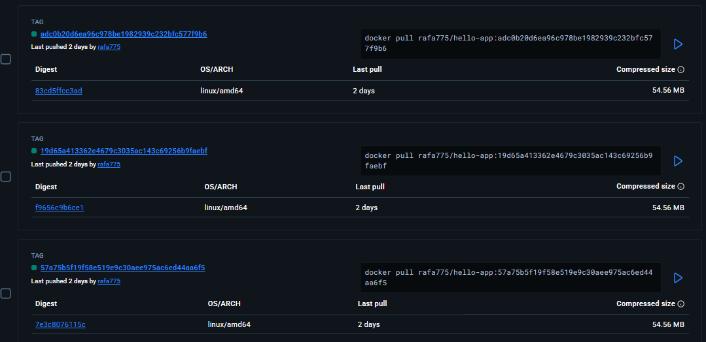
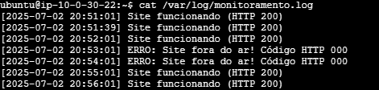
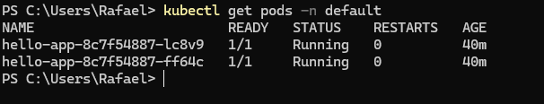

### Evidências do Projeto

**1. Evidência de Build no Docker Hub**

**2. Prova da Automação no Histórico do Git**

**3. Tela do ArgoCD Sincronizado**

**4. Terminal com Pods em Execução**

**5. Mensagem Final da Aplicação**
