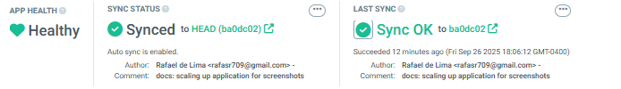
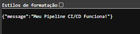

# Projeto CI/CD com GitHub Actions, ArgoCD e Kubernetes

Este projeto demonstra a criação de uma esteira de CI/CD (Integração Contínua e Entrega Contínua) completa para automatizar o ciclo de vida de uma aplicação web simples em FastAPI.

O objetivo é automatizar o ciclo completo de desenvolvimento, build, deploy e execução de uma aplicação, utilizando práticas de GitOps.

## 🚀 Visão Geral do Projeto

O fluxo de trabalho automatizado funciona da seguinte maneira:

1.  **Desenvolvedor**: Envia (`push`) uma alteração de código para o repositório da aplicação (`hello-app`).
2.  **GitHub Actions (CI)**:
    * Detecta o `push`.
    * Constrói uma nova imagem Docker da aplicação.
    * Envia a imagem para o Docker Hub.
    * Atualiza o arquivo `deployment.yaml` no repositório de manifestos (`hello-manifests`) com a nova tag da imagem.
3.  **ArgoCD (CD)**:
    * Detecta a alteração no repositório de manifestos.
    * Sincroniza o estado do cluster Kubernetes com o estado desejado, definido no repositório Git.
    * O Kubernetes então baixa a nova imagem e atualiza a aplicação.

## 🛠️ Tecnologias Utilizadas

* **Aplicação**: Python com FastAPI
* **Contêineres**: Docker & Docker Hub
* **Orquestração**: Kubernetes (via Rancher Desktop)
* **CI/CD**: GitHub Actions
* **GitOps (Entrega Contínua)**: ArgoCD

## ✅ Pré-requisitos

* Conta no GitHub (repo público)
* Conta no Docker Hub com um Token de Acesso criado
* Rancher Desktop com Kubernetes habilitado
* Git, Python 3 e Docker instalados localmente
* `kubectl` configurado
* ArgoCD instalado no cluster Kubernetes

## ⚙️ Guia de Configuração Passo a Passo

### Etapa 1: Preparação dos Repositórios

Dois repositórios Git são necessários para implementar a metodologia GitOps:

1.  **Repositório da Aplicação (`hello-app`)**: Contém o código-fonte da aplicação, o `Dockerfile` e o workflow do GitHub Actions.
2.  **Repositório de Manifestos (`hello-manifests`)**: Contém os manifestos do Kubernetes que descrevem o estado desejado da aplicação.

### Etapa 2: Configuração da Aplicação

No repositório `hello-app`, crie os seguintes arquivos:

* **`main.py`**:
    ```python
    from fastapi import FastAPI

    app = FastAPI()

    @app.get("/")
    async def root():
        return {"message": "Hello World"}
    ```

* **`requirements.txt`**:
    ```
    fastapi
    uvicorn[standard]
    ```

* **`Dockerfile`**:
    ```dockerfile
    FROM python:3.9-slim
    WORKDIR /app
    COPY requirements.txt .
    RUN pip install --no-cache-dir -r requirements.txt
    COPY . .
    CMD ["uvicorn", "main:app", "--host", "0.0.0.0", "--port", "8000"]
    ```

### Etapa 3: Configuração dos Manifestos Kubernetes

No repositório `hello-manifests`, crie os seguintes arquivos:

* **`deployment.yaml`**:
    ```yaml
    apiVersion: apps/v1
    kind: Deployment
    metadata:
      name: hello-app
      namespace: default 
    spec:
      replicas: 2
      selector:
        matchLabels:
          app: hello-app
      template:
        metadata:
          labels:
            app: hello-app
        spec:
          containers:
          - name: hello-app
            image: SEU_USUARIO_DOCKERHUB/hello-app:initial
            ports:
            - containerPort: 8000
    ```

* **`service.yaml`**:
    ```yaml
    apiVersion: v1
    kind: Service
    metadata:
      name: hello-app-service
      namespace: default
    spec:
      selector:
        app: hello-app
      ports:
        - protocol: TCP
          port: 80
          targetPort: 8000
    ```
    **Nota**: Lembre-se de substituir `SEU_USUARIO_DOCKERHUB` pelo seu nome de usuário do Docker Hub.

### Etapa 4: Criação da Pipeline CI/CD

1.  **Configuração dos Segredos no GitHub**:
    * No repositório `hello-app`, vá em `Settings` > `Secrets and variables` > `Actions`.
    * Crie os seguintes segredos: `DOCKER_USERNAME`, `DOCKER_PASSWORD`, e `PAT`.

2.  **Criação do Arquivo de Workflow**:
    * No repositório `hello-app`, crie o arquivo `.github/workflows/ci-cd.yml` com o conteúdo para construir a imagem, publicá-la no Docker Hub e atualizar o repositório de manifestos.

### Etapa 5: Configuração do ArgoCD

1.  **Acesse a Interface do ArgoCD**:
    * Use `kubectl port-forward` para acessar a interface web.
    ```bash
    kubectl port-forward svc/argocd-server -n argocd 8081:443
    ```
    * Acesse `https://localhost:8081`.

2.  **Crie a Aplicação no ArgoCD**:
    * Clique em `+ NEW APP`.
    * Preencha os campos essenciais, apontando para o repositório `hello-manifests`, o cluster de destino e o namespace `default`.

### Etapa 6: Teste Final

1.  **Acesse a Aplicação**:
    * Use `kubectl port-forward` para expor o serviço da sua aplicação:
    ```bash
    kubectl port-forward svc/hello-app-service -n default 9999:80
    ```
    * Acesse a aplicação no seu navegador em `http://localhost:9999`.

2.  **Teste o Fluxo End-to-End**:
    * Faça uma alteração no código Python, faça o `commit` e `push`.
    * Acompanhe a pipeline do GitHub Actions ser executada, seguida pela sincronização do ArgoCD, e verifique a mudança no navegador.

---

### Evidências Principais do Projeto

Aqui estão as capturas de tela que comprovam o sucesso da pipeline de CI/CD.

**1. Captura de tela do ArgoCD com a aplicação sincronizada**
*O ArgoCD detectou a mudança no repositório de manifestos e sincronizou o estado da aplicação no cluster Kubernetes, resultando em um status "Healthy" e "Synced".*


---

**2. Print da resposta da aplicação via navegador**
*A aplicação, acessada via `port-forward`, responde com a mensagem final, confirmando que o deploy da última versão foi bem-sucedido.*


---

## ✒️ Autores

* **Rafael de Lima** - *Desenvolvimento e implementação do projeto*
